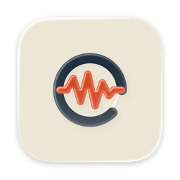
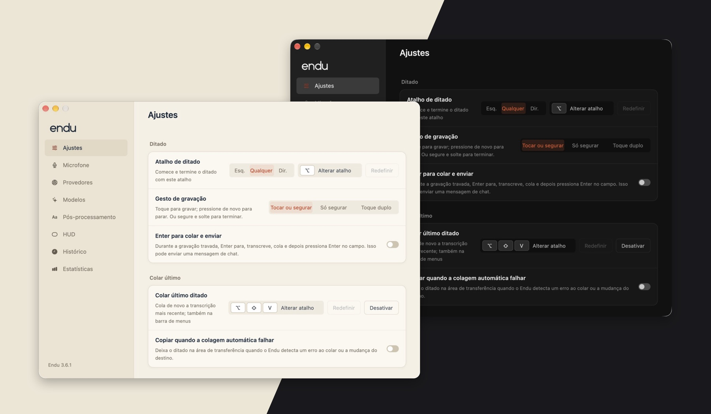
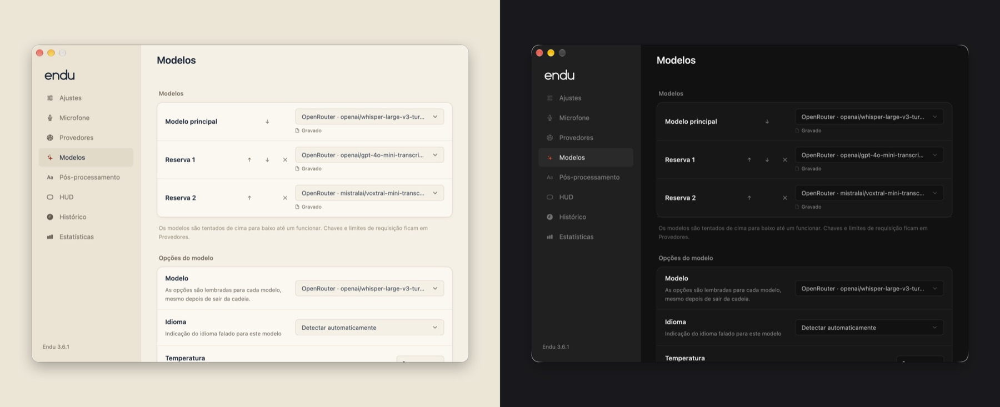
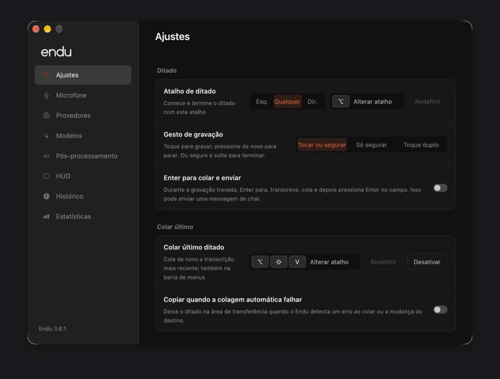
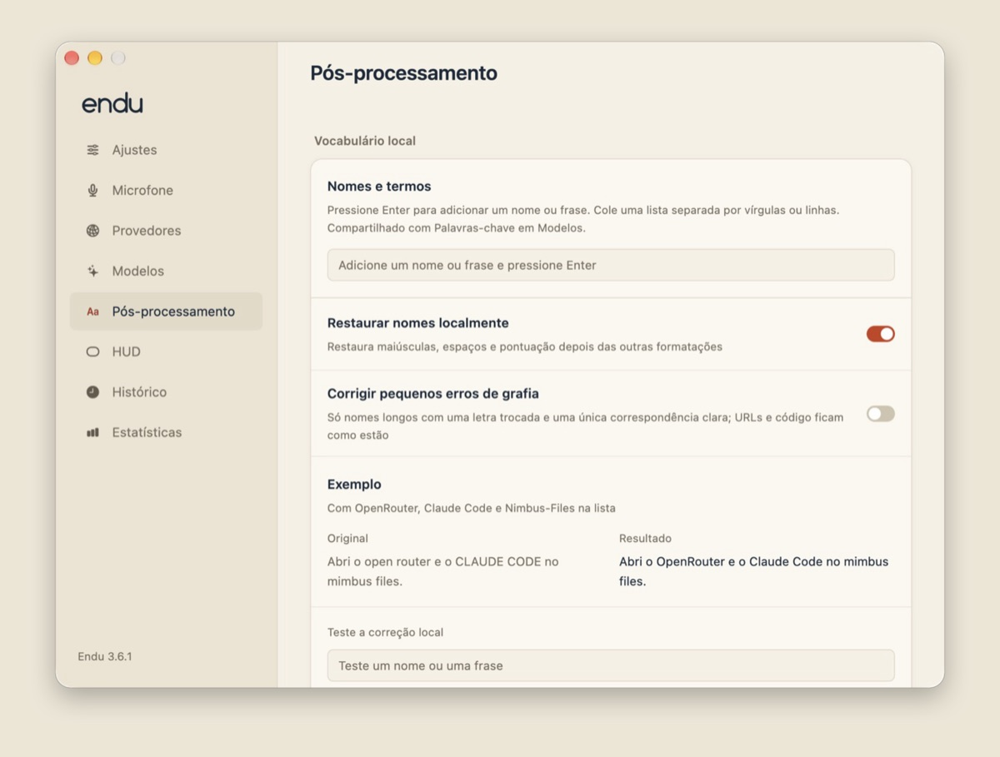
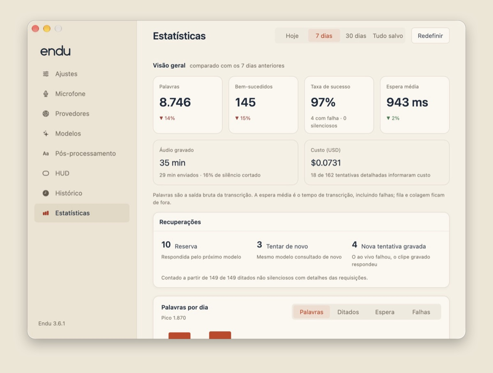
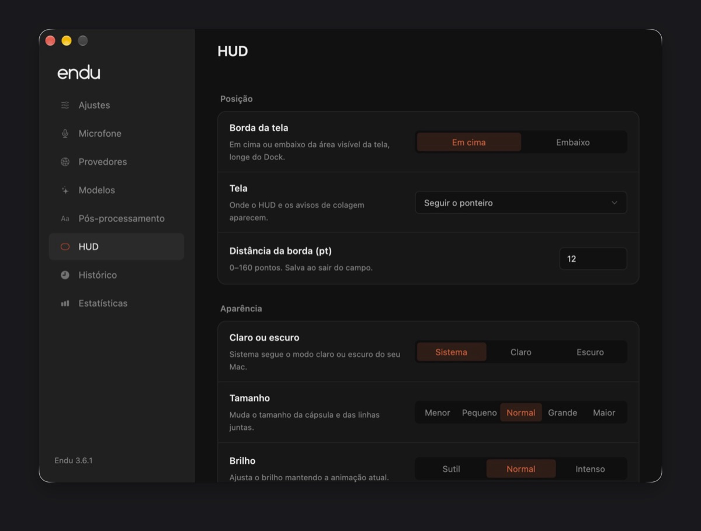

<p align="center">
  
</p>

<h1 align="center">endu</h1>

<p align="center">
  Ditado por atalho para macOS, para quem leva <i>speech to text</i> a sério.
</p>

<p align="center">
  <a href="#instalação">Instalação</a> ·
  <a href="#feito-para-quem-gosta-de-configurar">Por que o Endu</a> ·
  <a href="#provedores-e-modelos">Provedores</a> ·
  <a href="#é-um-fork">É um fork</a>
</p>

<p align="center">
  
</p>

**Endu** vem do tupi e quer dizer **ouvir**. Você toca um atalho, fala, toca de
novo, e o texto aparece onde o cursor estava. Por trás desse gesto simples há
uma cadeia de modelos com fallback, opções por modelo, pós-processamento local,
histórico com recuperação de áudio e estatísticas de cada provedor.

## Feito para quem gosta de configurar

O Endu é para quem gosta **muito** de *speech to text*: quem compara modelos,
quer saber qual provedor responde mais rápido, liga o streaming em um e
desliga no outro, e se importa com a grafia de cada nome próprio. Quase tudo
pode ser ajustado, mas cada ajuste tem um padrão sensato. Dá para instalar,
cadastrar uma chave e começar a ditar sem abrir nenhuma outra tela.

- **Cadeia de modelos com fallback.** Escolha um modelo principal e até duas
  reservas. Se o principal falhar, o próximo assume com o mesmo áudio; o texto
  só é colado uma vez, na ordem em que você ditou.
- **As capacidades de cada modelo.** Idioma, streaming, palavras-chave,
  formatação inteligente, pontuação, números e remoção de hesitações aparecem
  somente quando o modelo e o transporte escolhidos realmente oferecem. Cada
  modelo guarda seu próprio perfil.
- **Pós-processamento do seu jeito.** Minúsculas, sem pontuação, sem ponto
  final, linha única, nomes próprios restaurados com a grafia que você
  cadastrou. Tudo local, determinístico e desligado por padrão: nenhuma
  chamada extra a modelo.
- **Ao vivo ou gravado.** Com streaming, o áudio segue para o provedor
  enquanto você fala; se algo falhar no caminho, o clipe completo é
  reenviado. Nenhum texto parcial é colado.
- **Números de verdade.** Estatísticas por provedor e por modelo, com
  latência, P95 aproximado, taxa de sucesso, retries, fallbacks e custo
  informado ou estimado.
- **Simples onde importa.** Um atalho, um indicador discreto, sem janelas no
  caminho. As configurações ficam esperando, não atrapalhando.

<p align="center">
  
</p>

## Como funciona

```text
atalho → gravação ou streaming → provedor → pós-processamento local → colar
                                    ↓ erro
                               próxima reserva
```

1. **Toque** o atalho (por padrão, **Option**) para começar a gravar e toque
   de novo para terminar. Ou **segure** e solte.
2. O indicador mostra que está ouvindo e reage à sua voz.
3. O áudio vai para o modelo principal. Se ele falhar, a reserva seguinte tenta.
4. O texto passa pelas suas regras locais e é colado no aplicativo onde você
   começou, se ele ainda estiver em foco. Se não estiver, o Endu espera:
   **Colar Último Ditado** (**Option + Shift + V**) insere quando você quiser.

Você pode começar outro ditado enquanto o anterior é transcrito; os resultados
chegam na ordem em que foram falados. **Esc** cancela a gravação ou o ditado
pendente mais recente.

### O HUD

<p align="center">
  
</p>

Uma cápsula pequena, sempre clicável por baixo, no topo ou na base da tela.
Fica cinza enquanto o microfone abre, vermelha enquanto ouve (as linhas
acompanham sua voz), azul enquanto transcreve e mostra um visto ao colar.
Se o microfone estiver mudo, desconectado ou for o errado, ela escreve
**Sem áudio** já no primeiro segundo da gravação; se a voz chega baixa demais,
**Áudio baixo**. Assim você descobre antes de ditar um texto longo. O aviso
some quando o som volta e pode ser desligado em **HUD → Avisos de áudio**. Cor
de cada fase, tamanho, brilho, posição, monitor e aparência clara ou escura
ficam em **HUD**.

### Na barra de menus

<p align="center">
  
</p>

O mesmo “e” do ícone mora na barra de menus. Enquanto você fala, o zigue-zague
ondula; enquanto o texto é transcrito, a letra se reescreve sobre um contorno
apagado.

## Instalação

**Mac com Apple silicon e macOS 15 ou mais novo**, com
[Homebrew](https://brew.sh/). Cole no Terminal:

```sh
brew tap publi0/endu https://github.com/publi0/endu &&
brew install --cask publi0/endu/endu &&
open -a Endu
```

Para atualizar:

```sh
brew update &&
brew upgrade --cask publi0/endu/endu &&
open -a Endu
```

O Endu é assinado com um certificado próprio e persistente, que não é um
Developer ID e não passa por notarização da Apple. A identidade se mantém entre
versões, então as permissões concedidas continuam valendo nas atualizações. A
instalação não adiciona certificados confiáveis, não altera o TCC e não concede
permissões por conta própria.

## Primeiro uso

1. Abra o **Endu** e conceda **Microfone**, **Monitoramento de Entrada** e
   **Acessibilidade** na tela de configuração inicial. Quem concede é você,
   nos Ajustes do macOS.
2. Em **Provedores**, cadastre a chave de pelo menos um provedor. Cada chave
   fica em um item separado do Keychain.
3. Em **Modelos**, escolha o principal e, se quiser, as reservas.
4. Coloque o cursor onde quer escrever, toque **Option**, fale e toque
   **Option** de novo.

A transcrição usa a internet e a sua própria chave de API.

<p align="center">
  
  
</p>

## Provedores e modelos

| Provedor | O que o Endu usa |
| --- | --- |
| **OpenRouter** | Catálogo de modelos de transcrição, com vocabulário nas rotas verificadas. Recebe clipes gravados. |
| **OpenAI** | GPT Transcribe, GPT-4o e Whisper por upload; GPT Live Transcribe por WebSocket. |
| **Deepgram** | Nova-3 e Nova-2, por upload ou streaming, com keyterms, formatação, pontuação e números. |
| **ElevenLabs** | Scribe v2 por upload e Scribe v2 Realtime por WebSocket, com keyterms e remoção de hesitações. |
| **Grok (xAI)** | Grok Voice Transcribe por upload ou streaming, com keyterms, formatação e hesitações. |
| **Google** | Gemini Transcribe e Transcribe Live, com a chave do AI Studio, vocabulário e Transcrição inteligente. |
| **Meta** | Muse Voice Transcribe por upload ou streaming, com palavras-chave e idioma. |

A cadeia padrão é **ElevenLabs Scribe v2 Realtime** (ao vivo), com
**MAI-Transcribe 2** pelo OpenRouter e **Grok Voice Transcribe 2.0** como
fallbacks; a chave de qualquer um deles já basta para começar. Só o modelo
principal transmite durante a gravação: os fallbacks recebem o clipe
completo depois que você termina, num único envio. Por isso modelos que só
funcionam ao vivo, como o Scribe v2 Realtime, só podem ser o principal, e o
streaming aparece fixo nas opções dos fallbacks.

Os seletores mostram somente modelos de provedores com chave cadastrada. A
busca combina nome, ID, provedor e capacidades: `deepgram streaming`,
`google keywords`, `batch`. Avisos de preço, pré-requisitos e restrições
aparecem logo abaixo do modelo a que se referem.

Cada combinação de provedor e modelo guarda seu perfil: idioma, streaming e
demais opções. Na primeira escolha, o modelo herda o que for compatível do
anterior; ao voltar a um modelo, suas escolhas voltam com ele. As
**palavras-chave** são a exceção: uma lista única, compartilhada por toda a
cadeia, enviada a cada modelo no formato e nos limites que ele aceita.

<details>
<summary><b>Streaming, fallback e limites</b></summary>

Streaming envia o áudio durante a fala, mas o Endu só cola o texto final, depois
do pós-processamento. Streaming, formatação, pontuação, números e remoção de
hesitações começam ligados nos modelos compatíveis; escolhas desligadas
continuam desligadas. O que o modelo não oferece não aparece e não é enviado.

Uma falha de rede, a perda de blocos de áudio ou uma confirmação ausente
invalida a resposta ao vivo, e o clipe completo é enviado de novo pela cadeia.
Uma pausa na fala não encerra o ditado. O streaming não compacta pausas como
o **Cortar silêncio** dos clipes gravados, então o silêncio também pode ser
transmitido e cobrado.

Qualquer erro passa para a próxima reserva. Um HTTP 429 que peça uma espera
dentro do limite configurado ganha uma nova tentativa no mesmo modelo. Clipes
longos enviados depois da gravação são divididos em trechos. Os limites de
tempo e a URL do OpenRouter ficam em **Provedores → Avançado**; a URL exige
HTTPS, exceto em loopback local.

</details>

<details>
<summary><b>Vocabulário: nomes que o modelo precisa acertar</b></summary>

Em **Modelos → Palavras-chave**, cada nome vira uma pílula. **Return**
adiciona; espaços mantêm expressões como “Claude Code” juntas; colar várias
linhas ou termos separados por vírgula adiciona todos de uma vez.

- **Enviar palavras-chave** manda a lista a todos os modelos compatíveis da
  cadeia, cada um dentro dos seus limites. Nenhum termo é cortado ao meio.
- **Restaurar nomes localmente** corrige caixa, espaços, hífens e pontuação de
  nomes completos depois da transcrição.
- **Corrigir pequenos erros de grafia**, desligado por padrão, aceita uma
  diferença de caractere em nomes longos quando há um único candidato claro.

O catálogo do OpenRouter não informa com precisão quais rotas aceitam
vocabulário. O Endu verifica as rotas com um áudio sintético de dois segundos e
nomes inventados, nunca com gravações ou nomes seus, e só considera o suporte
comprovado com um controle negativo ou um efeito reproduzível. Essas
verificações podem gerar pequenas cobranças. Para rodar pela linha de comando:

```sh
cargo run -- validate-vocabulary
```

</details>

<details>
<summary><b>Configuração em arquivo e variáveis de ambiente</b></summary>

A cadeia e os perfis ficam em
`~/Library/Application Support/hex-openrouter/openrouter.json`, relido a cada
ditado. IDs sem prefixo são do OpenRouter; provedores diretos usam
`provedor::modelo`:

```json
{
  "transcription": {
    "models": ["deepgram::nova-3", "openai::gpt-transcribe", "microsoft/mai-transcribe-2"],
    "model_options": {
      "deepgram::nova-3": { "language": "pt", "streaming": true },
      "openai::gpt-transcribe": { "language": "pt" }
    },
    "trim_silence": true,
    "attempt_timeout_seconds": 30,
    "total_timeout_seconds": 90
  }
}
```

Prefira o Keychain. `OPENROUTER_API_KEY`, `OPENAI_API_KEY`, `DEEPGRAM_API_KEY`,
`ELEVENLABS_API_KEY`, `XAI_API_KEY`, `GEMINI_API_KEY` e `MODEL_API_KEY` (Meta)
têm precedência sobre a chave salva do provedor correspondente.

</details>

## Pós-processamento

Regras locais aplicadas antes de colar, todas desligadas por padrão e com um
exemplo ao vivo na própria tela: **Texto em minúsculas**, primeira letra
minúscula, remover pontuação, reticências ou **ponto final**, juntar espaços,
**Linha única** e a restauração dos nomes do seu vocabulário.

Cada ditado guarda uma cópia das regras do momento em que foi enviado. Mudar as
regras depois não reescreve o Histórico. Um resultado vazio nunca é colado.

## Microfone, sons e atalhos

- **Microfone**: dispositivo, prioridade automática entre microfones, canal
  de entrada em interfaces com vários canais, níveis RMS e pico do último
  clipe, **Cortar silêncio** (ligado) e o modo do microfone. Por padrão ele
  só abre no atalho, então o indicador do macOS aparece apenas enquanto você
  dita; **Manter pronto** guarda um trecho antes do atalho para não perder a
  primeira sílaba.
- **Durante o ditado**: por padrão o áudio do sistema **abaixa para 30%**;
  também dá para **Silenciar**, **Pausar** ou **Manter**, sempre com fades
  curtos que respeitam ajustes manuais de volume.
- **Atalhos**: **Tocar ou segurar** (padrão), **Só segurar** ou **Toque
  duplo**. **Enter para colar e enviar**, desligado por padrão, termina a
  gravação travada, cola e envia um Enter ao mesmo aplicativo.
- **Sons**: o **Som de início** padrão é o **Respiro**; também há Gota, Duas
  notas, Caneta, Vidro, Madeira e o Clássico, cada um com botão para
  ouvir. Início, fim e erro têm volumes independentes.

## Aparência e idioma

Dois temas, nomeados pelos materiais do ícone: **Tabatinga**, o claro, cor de
barro; **Grafite**, o escuro. Ambos com um único destaque em urucum. A
**Aparência** segue o sistema por padrão e pode ser fixada em claro ou escuro;
o HUD tem a sua própria escolha.

A interface inteira está em **português**, **inglês** e **espanhol**. O
**Idioma** segue o sistema por padrão, com inglês como alternativa, e pode ser
trocado na hora em **Ajustes → Aplicativo**.

## Histórico, recuperação e estatísticas

<p align="center">
  
  
</p>

O **Histórico** guarda os ditados colados com sucesso por sete dias (ajustável),
com o aplicativo de destino, duração, latência, modelos, fallbacks e o custo de
cada tentativa. Quando o provedor não informa o custo, o Endu estima pelo preço
de tabela publicado e marca o valor com **≈**.

Antes de cada envio, o clipe é salvo localmente em WAV. Se todos os modelos
falharem, a gravação aparece no Histórico com o motivo e **Tentar e copiar**,
que usa a cadeia atual e copia o texto recuperado. Essas gravações não expiram
com a retenção normal: ficam até você recuperá-las ou excluí-las.

As **Estatísticas** comparam períodos (hoje, 7 dias, 30 dias, tudo) e detalham
as tentativas por provedor ou modelo, separando **Ao vivo** de **Gravado**:
latência média, P95 aproximado (a partir de 20 respostas), retries, fallbacks,
erros por tipo e custo. O cartão **Cancelado durante o streaming** mostra o
áudio que já tinha ido ao vivo para o provedor quando você cancelou a gravação
(e que normalmente é cobrado), com o custo estimado (≈) e a fatia do áudio
enviado. Só totais diários são guardados, nunca texto ou áudio.

## Privacidade

O áudio vai somente ao provedor do modelo em uso (e, no caso do OpenRouter,
passa por ele). As chaves ficam no Keychain e são lidas pela ferramenta
`/usr/bin/security` da Apple pela entrada padrão: nunca aparecem em argumentos
de processos, logs ou arquivos temporários. Chaves e endereços não entram na
exportação de preferências.

<details>
<summary><b>Onde ficam os arquivos</b></summary>

Em `~/Library/Application Support/hex-openrouter` (o nome antigo foi mantido
de propósito):

| Arquivo | Conteúdo |
| --- | --- |
| `settings.json` | Preferências e atalhos. |
| `openrouter.json` | Cadeia de modelos e perfis por modelo. |
| `history.json` | Ditados e metadados, conforme a retenção escolhida. |
| `recording-recovery/` | Áudios pendentes ou com falha e textos recuperados, acessíveis só ao seu usuário. |
| `stats.json` | Totais diários, sem texto, áudio ou respostas de erro. |
| `logs/` | Eventos e diagnósticos. O log de eventos inclui o texto colado; revise antes de compartilhar. |

Desligar ou limpar o Histórico não limpa os logs.

</details>

## É um fork

O Endu é um fork do **[HEX](https://github.com/anomalyco/hex)**, criado por
Kit Langton e hoje mantido pelo time do OpenCode. O fluxo de “segurar, falar e
colar” vem de lá, e o crédito é deles.

O caminho aqui foi outro: um app menor, focado em transcrição remota e em
controle fino sobre ela. Saíram os modelos locais, Voice Commands, Voice Action,
Modes e a integração com OpenCode, reuniões, a API local e o SDK, o suporte a
Linux, o Sparkle e a sincronização com o upstream. Entraram os provedores
nativos com streaming, a cadeia de fallback, perfis por modelo, vocabulário,
pós-processamento, recuperação de gravações, estatísticas e a nova identidade.

Não há sincronização automática com o projeto original, e problemas do Endu
devem ser relatados [aqui](https://github.com/publi0/endu/issues), não no HEX.

## Feito em Rust

O Endu é um app nativo escrito em Rust, com a interface em
[GPUI](https://www.gpui.rs/) (o framework de UI do editor Zed) e o HUD
desenhado direto na GPU com Metal. Não há Electron, navegador embutido nem
runtime de JavaScript: um único executável que fica quieto na barra de
menus até você tocar o atalho.

| Medida | Resultado |
| --- | --- |
| Download (ZIP da versão 3.6.1) | **11 MB** (o HEX original era um DMG de 34,9 MB) |
| Janela de ajustes abrindo | menos de **0,8 s** |
| Na barra de menus, parado | ~**0,01%** de um núcleo, ~**34 MB** de memória |
| Com a janela aberta, parado | ~**0,1%** de um núcleo, ~**112 MB** |
| Ditando, com o HUD animando | ~**25%** de um núcleo, só enquanto grava e transcreve |
| Testes automatizados | **681** testes unitários e de integração |

Medições num MacBook Air M2, macOS 27.0.1, build de release, média de 20
segundos com `top`. A memória é a pegada informada pelo macOS. Captura,
fila de transcrição e colagem rodam em threads separadas com filas
limitadas, então gravar nunca espera a rede, o histórico ou as estatísticas.

## Desenvolvimento

Precisa de macOS, Rust stable, Python 3.11 ou mais novo e Xcode com o
compilador Metal. Antes de cada commit, a
validação completa roda localmente:

```sh
scripts/check-local.sh
```

Para ver as telas sem tocar na sua configuração, chaves ou rede:

```sh
cargo run -- preview settings --language portuguese --appearance dark
```

Também existem os previews `microphone`, `models`, `providers`,
`post-processing`, `hud`, `history`, `statistics`, `onboarding`,
`dictation-hud` e `paste-notice`. O GitHub Actions é usado **somente** para
publicar releases: compilar, assinar, empacotar e atualizar o cask. A versão
em `Cargo.toml` é a versão publicada. Detalhes de arquitetura e contratos
internos estão no [AGENTS.md](AGENTS.md).

## Licença

[MIT](LICENSE). Dependências e atribuições em
[THIRD_PARTY_NOTICES.md](THIRD_PARTY_NOTICES.md).
